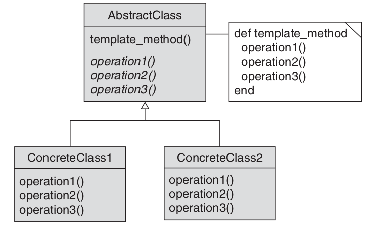

**GoF** patterns implemented in *Ruby*. Has learning purpose.

There is a list of similar reporsitories in different languages:
* [java-design-patterns](https://github.com/iluwatar/java-design-patterns)
* [design-patterns-in-ruby](https://github.com/nslocum/design-patterns-in-ruby)
* [javascript-patterns](https://github.com/shichuan/javascript-patterns.git)
* ...

Some examples implemented based on samples from book **Design Patterns in Ruby - Russ Olsen, 2007**.

* [Main aspects] (#main-oop-aspects)
* [Template method] (#template-method)
* [Strategy] (#strategy)
* [Observer] (#observer)
* [Composite] (#composite)

## Main aspects:

1. Separate the things that change from those that stay the same:
  * improves maintainability
  * easier to introduce a change
  * promotes DRY code

2. Program to an interface, not an implementation:
  * increases modularity
  * code becomes more change resistant

3. Prefer composition over inheritance:
  * increases encapsulation
  * increases usability

4. Delegate, delegate, delegate:
  * flexibility

  **Note**: there is a cost of delegation - extra method call and boilerplate code.

5. You ain't gonna need it:

  Do not implement things that you don't need.

## Template method

Method pattern is simply a fancy way of saying that if you want to vary an algorithm, one way to do so is to code the invariant part in a base class and to encapsulate the variable parts in methods that are defined by a number of subclasses.

**Note**: duck typing has an important role here for dynamic languages.

Disadvantage: no runtime change.

## Strategy

![] (strategy/strategy.png)

Key idea is to define a family of objects, the **strategies**, which all do the same thing and all support the same interface. There is a user of the strategies - **context** - can treat the strategies like interchangeable parts.

  * switch strategies in runtime
  * better separation of concerns by pulling out a set of strategies

**Note**: with Ruby we have 'quick and dirty' way to define strategy pattern using `Proc`s. But code-block strategies work only when the strategy interface is simple, one method affair.

## Observer

![] (observer/observer.png)

The Observer pattern allows you to build components that know about the activities of other components without having to tightly couple everything together. By creating a clean interface between the source of the news (the observable object) and the consumer of that news (the observers), the Observer pattern moves the news without tangling things up.

There are two methods of passing data from the subject to observers:

* **Push model** - the subjects send detailed information about the change to the observer whether it uses it or not. Inefficient when a large amount of data needs to be sent and it is not used.

* **Pull model** - the subject just notifies the observers when a change in his state appears and it's the responsibility of each observer to pull the required data from the subject. This can be inefficient because the communication is done in 2 steps and problems might appear in multi-threading environments.

**Note**: Observer and Strategy pattern look very common: both feature an object that makes calls out to some other object. In the case of observer, we are informing the other object of the events occurring back at the observable, and in the case of the strategy, we are getting the strategy object to do some computing.

**Note**: there is [Observable](http://ruby-doc.org/stdlib-2.2.0/libdoc/observer/rdoc/Observable.html) module in core ruby.

## Composite

![] (composite/composite.png)

Composite pattern is needed when you are trying to build a hierarchy or tree of objects, and you do not want
the code that uses the tree to constantly have to worry about whether it is dealing with a single object or a whole bushy branch of the tree.

Composite consists of base interface - the **component**, **leaf** classes and the **composite** that is build from subcomponents.
